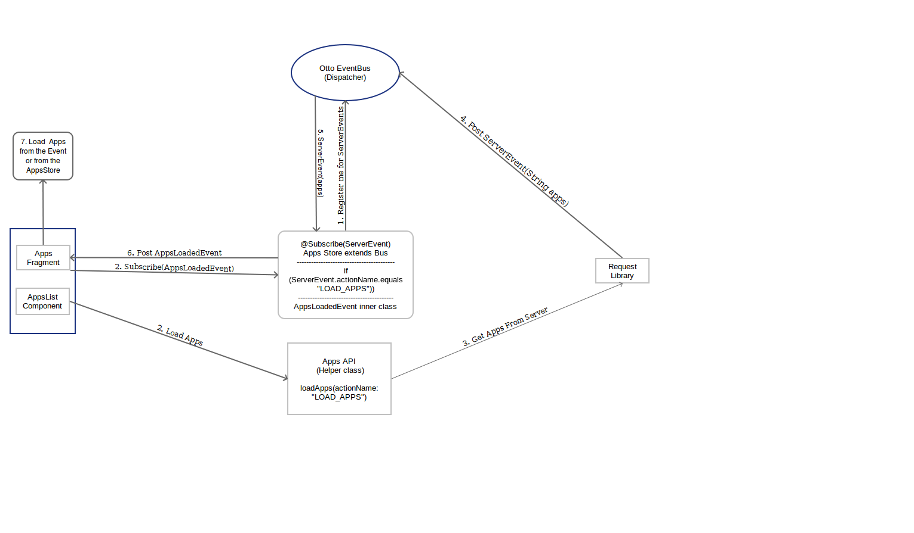

# Android Flux Architecture Example with [Otto](http://square.github.io/otto/) events

First you need to checkout the [Flux](https://facebook.github.io/flux/) architecture guide by the Facebook team.
[Here](http://nmp90.com/2015/03/getting-to-know-the-flux-architecture/) is a good source also to check it out.

## Android Flux Architecture

In Flux we have: Actions, Dispatcher, Stores, Custom Components(React Components in example for web) and may be an Utils to generate the actions.
I have implemented them as it follows:

1. Actions - We have a simple actions class containing just a constant. This action constants will help stores recognize if they need to responsed to a given action.
2. Dispatcher - I have implemented the Otto bus as Dispatcher. It is used just to send events to all stores.
3. Dispatcher Events in Flux **WEB**  - each object a dispatcher sends contains
     * ActionType - this is a server action or a view action (like load apps from server or user clicked the x button).
     * Action - this is the name of the action as a string. Stores know what to do by the action name - they filter it in a switch and decide if it is for them or not.
     * Data - an object with the received data (server data or ui).
4. Dispatcher Events in Flux **Android** (this is how I have implemented them)
    * We have a BaseEvent class and a Server/Ui Event classes. The BaseClass contains - actionType, action and data
    * Each store can subscribe to a Server or Ui event by using the @Subscribe annotation from Otto and expect one of the two classes
    * Data is transferred as String. Each store has to deserialize it to the class it expects using Gson.
    * Events can contain success and error message so a notification can be displayed if something has messed up.
5. Stores in **WEB**-
    * They use callbacks to notify the components which are subscribed to them that there is new data.
    * There is mainly one callback used which is 'onChange'
    * When notified components get the new data from the Store from a public store method and update themselves.
6. Stores in **Android** (my implementation)
    * We have a BaseStore class which has one available listener - OnChangeListener. BaseStore has a list of listeners implemented and they can be called with the onChange() method.
    * Each store can provide additional listener. I don't think that more than 1 additional in rare cases will be needed.
    * (**Update 23.05**) Each store can be represented as a custom otto bus. So components don't need to declare interfaces to receive update events.
    * Stores subscribe using the @Subscribe annotation from Otto. They can decide if they want to receive Server or Ui events.
    * Stores filter if the event is about them by the event action string.
7. Custom components (in **WEB** they are React components) -
    * We have the AppsList custom component. It attaches to the AppStore in onAttachToWindow and removes in onDetachFromWindow methods.
    * The component rerenders by itself when it receives notification from the store.
    * I LOVE THE FLEXIBILITY OF THE COMPONENTS
8. Utils - we have the AppsAPI which simulates a server request.

You can check that when you load apps in the Component activity, they are loaded in the MainActivity also. Works like magic.

Feel free to make pull requests or comments. I will be very happy if we figure out a better design and architecture.
I really enjoy the Flux idea and I think it is wonderful for Android. Events for the win!